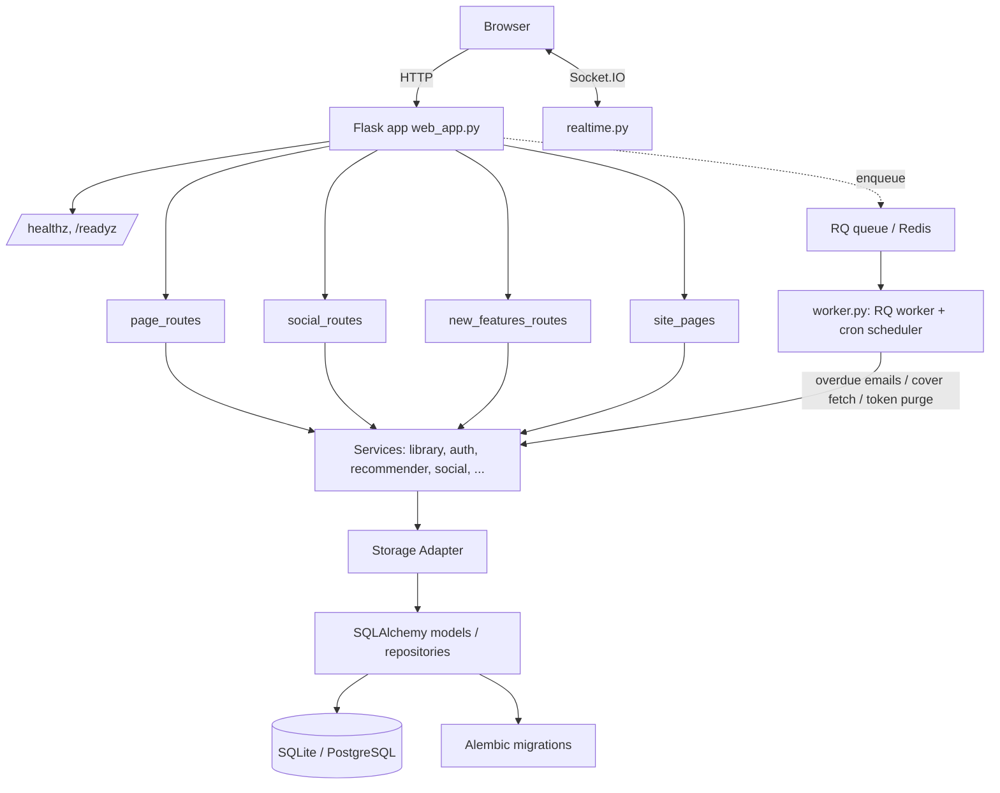

# 📚 Book-Tale

<p align="center">
  
  
  
  
  
  
</p>


A full-featured library management system — catalog, lending, reservations, fines, reading challenges, a social feed, realtime notifications, and book recommendations — built with Flask + SQLAlchemy + a bundled esbuild frontend.

> **Honesty first:** this README describes what the code actually does today, verified against a green test suite. Where something is planned but not built, it says so explicitly — see **What's real vs. aspirational** below.

---

## 📋 Table of Contents

- [Status](#status)
- [✨ Features](#-features)
- [🏗️ Architecture](#️-architecture)
- [🧰 Tech stack](#-tech-stack)
- [🚀 Getting started](#-getting-started)
- [🔌 API surface](#-api-surface)
- [🤖 AI / Recommendations](#-ai--recommendations)
- [📁 Project structure](#-project-structure)
- [📚 Documentation](#-documentation)
- [🧭 Roadmap / what's next](#-roadmap--whats-next)
- [License](#️-license)

---

> 📸 **Screenshot placeholder:** Add a screenshot of the catalog search and a book detail page.

---

## Status

| Area | State |
|---|---|
| Tests | **202 passing** (`pytest tests/`; 2 skipped — Redis-dependent) |
| Routes | **132** registered on the Flask app |
| Seed catalog | **11,127 books** (`app/services/recommendations/ml/Dataset/books.csv`) |
| Storage | SQLAlchemy ORM (SQLite dev / PostgreSQL prod), Alembic migrations |
| Frontend | Jinja2 templates + esbuild-bundled JS (content-hashed assets) |
| CI | `.github/workflows/ci.yml` (lint, tests, security scans) |

---

## ✨ Features

### Core library operations
- Book catalog with **search and filtering** (category, availability, author, publisher, ISBN, date added, sort) and category/author browsing
- **Issue / return / reserve** flows wrapped in DB transactions (concurrency-safe — no oversell of the last copy, tested with 20 racing threads)
- **Borrow limits**, membership expiry, **fine calculation** for late returns
- **Overdue tracking** and per-user borrowing history
- **Reports & statistics** (issuance, returns, fines, active users)

### Reader & community features
- Reading **progress tracking** (pages read, goal completion) + **reading challenges** with streaks
- **Wishlist**, **reading lists**, book **reviews & ratings**
- Social **feed** with posts, comments, likes, and **follows**
- **Communities**, **book series** tracking, personal reading **diary**
- **Notifications** — in-app + realtime via Socket.IO
- **Gamification**: badges, streaks, reading goals
- **Book recommendations** — rule-based "for you" (reading history + category affinity) and trending; see [AI / Recommendations](#-ai--recommendations) for the honest picture
- **AI Reading Companion** chat (`/api/ai/chat`) — keyword-intent assistant; see the same section

### Accounts & administration
- Registration/login/logout with **bcrypt password hashing** and `MEM-XXXX` IDs
- Email **verification** and **password reset** with expiring tokens
- **Role-based access**: `user`, `librarian`, `admin` — self-registration is hard-capped to `user` (privilege escalation is tested against)
- **Admin dashboard**: member management, book management, settings, reports, fines
- **Admin audit trail** (`/admin/audit`): append-only log of every admin-settings change — who, what (old → new value), when, and from which IP; secrets redacted (`[redacted]`), searchable and paginated in the admin UI
- User **settings** (profile, notifications, privacy, theme, reading prefs)

### Security posture
- **CSRF protection on by default** (Flask-WTF) across all state-changing endpoints, with a meta-tag + fetch interceptor covering every JS POST
- **Rate limiting** (Flask-Limiter): login `10/min` (POST only — `deduct_when` counts just failed attempts; GET page loads are exempt), register/forgot/reset `5/min`, uploads `10/min`, admin delete/moderation actions `20/min`, plus a global `200/min` default. Password changes and admin-settings saves are `10/min` keyed per **account** (`key_func=_user_key`), so a distributed attacker can't evade the budget by spreading requests across IPs; `deduct_when` counts only failed attempts there too. Shared-surface & engagement POSTs get explicit ceilings so a compromised session can't flood the feed or stuff votes: content spam (posts, reposts, comments, replies, reviews, lists, shelves — `30/min`, GET comment fetches exempt), create-heavy surfaces (clubs, wishlist suggestions — `10/min`), AI companion chat `30/min`, and engagement manipulation (likes, votes, helpful, follows, upvotes, club joins — `60/min`) — all keyed per IP. Self-scoped writes (notifications read, bookshelves, favorites, diary, bookmarks, progress, post/club/shelf deletes) stay at the `200/min` default
- **Fail-fast boot**: refuses to start with an unset/default `SECRET_KEY`
- **Secure session cookies**: `HttpOnly`, `SameSite=Lax`, `Secure` in production
- **Security headers** on every response: CSP, `X-Content-Type-Options: nosniff`, `X-Frame-Options: DENY`, `Referrer-Policy`, `Permissions-Policy`
- Deterministic (stable) avatar colors — no per-process `hash()` randomness
- Uploads **magic-byte verified** (Pillow) and **re-encoded server-side** — a file renamed from HTML/JS to `.png` is rejected, and payloads embedded in genuine images are stripped before touching disk (extension allow-list + size cap as well)
- **Password policy ≥12 characters**, enforced server-side on every password surface (registration, reset, settings change)
- **Password-reset / email-verify tokens are DB-backed** with explicit expiry (15 min / 24 h) — they survive restarts, are single-use, and are reaped by a purge job
- **Regression tests** for every security fix (privilege escalation, CSRF rejection, default-secret boot, rate-limit presence + `deduct_when` behavior)

### Operations
- **`/healthz`** (liveness) and **`/readyz`** (DB reachability, generic errors — no internal detail leakage) probes
- **Background jobs** (Redis + RQ): cover/metadata fetch is enqueued off the request path; overdue-email reminders run on a real cron schedule (daily 09:00, overridable via `CRON_OVERDUE_EMAILS`); expired auth tokens are swept hourly (`CRON_TOKEN_PURGE`). A dedicated `worker` service (`python worker.py`) runs the RQ worker + cron scheduler. If Redis is unreachable the app degrades to a **bounded** thread pool (`COVER_FETCH_WORKERS`, default 4) instead of the old unbounded raw threads — see [ADR 0010](docs/decisions/0010-background-jobs-rq.md)
- **Structured logging** with `RotatingFileHandler`, JSON-formatted lines, and per-request IDs for correlation
- **Docker**: multi-stage `Dockerfile` + `docker-compose.yml` (app + PostgreSQL + Redis + worker + nginx)

---

## 🏗️ Architecture

```
┌──────────────────────── Browser ────────────────────────┐
│  Jinja2 templates (base.html, macros)  +  bundled JS    │
│  (static/js → esbuild → static/dist, content-hashed)    │
└───────────────┬───────────────────────────┬─────────────┘
                │ HTTP                      │ WebSocket (Socket.IO)
┌───────────────▼───────────────────────────▼─────────────┐
│                     Flask app (web_app.py)              │
│  security headers · request-ID · CSRF · rate limiting   │
│  /healthz · /readyz                                     │
└───────────────┬─────────────────────────────────────────┘
                │ route modules (init_* on the app)
┌───────────────▼─────────────────────────────────────────┐
│  page_routes.py · social_routes.py · new_features_routes│
│  site_pages.py · auth (login/register/reset)            │
└───────────────┬─────────────────────────────────────────┘
                │ services layer
┌───────────────▼─────────────────────────────────────────┐
│  library · auth · recommender · notifications · social  │
│  reviews · gamification · series · challenges · diary   │
│  wishlist · reading_progress · communities · lists      │
└───────────────┬─────────────────────────────────────────┘
                │ storage adapter (db/storage_adapter.py)
┌───────────────▼─────────────────────────────────────────┐
│  SQLAlchemy ORM (db/models.py, db/repositories.py)      │
│  Alembic migrations (migrations/versions/)              │
│  SQLite (dev) ── PostgreSQL (prod, docker-compose)      │
└─────────────────────────────────────────────────────────┘
```



**Layering:** routes call services, services call the storage adapter, the adapter owns the SQLAlchemy session. Two deliberate exceptions touch SQL directly: the `/readyz` probe (`SELECT 1`) and the `/admin/audit` page (opens a `session_scope()` to query the `AuditLogRepository` — the audit trail is append-only and read straight from the repo).

---

## 🧰 Tech stack

| Layer | Choice |
|---|---|
| Web framework | Flask |
| ORM | SQLAlchemy 2.x |
| Migrations | Alembic |
| Templates | Jinja2 (autoescape ON, macro library in `templates/macros.html`) |
| Frontend build | esbuild (`scripts/build_frontend.mjs` → `static/dist/` + `manifest.json`) |
| Realtime | Flask-SocketIO |
| Background jobs | RQ + Redis (worker service; bounded pool fallback) |
| Auth | Session-based (signed cookies) + bcrypt hashing; CSRF via Flask-WTF |
| Rate limiting | Flask-Limiter with Redis-backed storage (budgets survive restarts & are shared across gunicorn workers; in-memory fallback on Redis outage) |
| Logging | stdlib `logging` + `RotatingFileHandler`, JSON formatter, request IDs |
| Testing | pytest (unit + integration + security suites) |
| Infra | Docker (multi-stage), docker-compose, GitHub Actions |

---

## 🚀 Getting started

### Local dev

```bash
# 1. Install dependencies
pip install -r requirements.txt

# 2. Set required env vars (boot fails fast without them)
export SECRET_KEY="$(python -c 'import secrets; print(secrets.token_hex(32))')"
export DEFAULT_ADMIN_PASSWORD="$(python -c 'import secrets; print(secrets.token_urlsafe(16))')"

# 3. (Optional) seed the catalog — 11,127 books + demo users
python seed_data.py
python seed_users.py    # admin: ADMIN001 / the password you set above

# 4. Run
python web_app.py       # http://localhost:5000
```

> **No default passwords are advertised.** The admin password must be set via the `DEFAULT_ADMIN_PASSWORD` env var before boot (the app refuses to start with it unset). Seed accounts are created with a generated password (see `seed_users.py`).

### With Docker

```bash
docker compose up --build
```

brings up the app + PostgreSQL + Redis (+ worker/nginx services — see **What's real vs. aspirational** for the parts that are still scaffolding).

### Run the tests

```bash
pytest tests/            # 202 tests: unit + integration + security
```

Test suite composition (verified with `pytest --collect-only`):

| File | Tests | Covers |
|---|---|---|
| `tests/security/test_web_security.py` | 90 | privilege escalation, CSRF, rate limiting, /readyz, XSS, secret-defaults, admin audit trail, upload magic-byte validation, centralized error handlers, password policy, OpenAPI docs |
| `tests/test_auth_tokens.py` | 10 | DB-backed one-time tokens: round-trip, single-use, expiry, purge, cold-process restart survival |
| `tests/test_jobs.py` | 16 | RQ background jobs: cover fetch, overdue-email batch, token purge, facade bounded-pool fallback, cron next-run helper, worker cold-start schema ensure |
| `tests/test_db_wiring.py` | 18 | storage adapter ↔ DB round-trips, audit-log repository (search/pagination) |
| `tests/test_library.py` | 53 | catalog, transactions, recommender, services |
| `tests/test_db_layer.py` | 14 | concurrency (no oversell), atomicity, rollback |
| `tests/test_reading_progress.py` | 2 | reading progress totals |

---

## 🔌 API surface

The app exposes JSON endpoints under `/api/...` (settings, notifications, feed, social actions, AI chat, etc.) plus a full server-rendered web UI.

- **Live API docs at `/api/docs`** — a generated **OpenAPI 3.1** spec (`/api/openapi.json`) rendered by Swagger UI (pinned CDN) with working "Try it out" against a running instance. The spec documents the app's real endpoints honestly (no fictional routes).
- JSON responses use simple `{"success": true/false, ...}` / `{"error": ...}` shapes; API-path errors from the centralized handlers use `{"data": null, "error": {"code", "message"}}` with correct status codes (400/401/403/404/405/413/415/422/429/500).

---

## 🤖 AI / Recommendations

**The honest picture:**

- **Recommendations** (`recommender.py`) are **rule-based**: per-user recommendations are derived from reading history + category affinity, plus a trending fallback. They are not ML.
- The **AI Reading Companion** (`/api/ai/chat`) is a **keyword-intent assistant** (e.g. "recommend", "similar", "summary") that surfaces real catalog data — it is **not** an LLM.
- The repo contains a research notebook under `app/services/recommendations/ml/` (SVD / collaborative-filtering comparison, offline evaluation harness in `Model/`) — this is **exploratory work, not wired into the serving path**.

Nothing here is hidden: the code is the source of truth, and the UI labels reflect the rule-based implementation.

---

## 📁 Project structure

```
web_app.py / main.py / start.py / worker.py   # Thin entry points -> app.routes / app.jobs
app/
  config/        # settings.py: env-driven config + fail-fast SECRET_KEY validation
  core/          # exceptions.py, logger.py, utils.py
  models/        # book.py, user.py (domain dataclasses)
  storage/       # storage.py (legacy JSON persistence)
  db/            # SQLAlchemy: storage_adapter.py, database.py, models.py, repositories.py, service.py
  routes/        # web_app.py, main.py, page_routes.py, social_routes.py, new_features_routes.py, ...
  services/      # auth/ books/ (library, reviews, series, backup, cover) email/ notifications/ reading/ recommendations/ social/
  jobs/          # RQ background jobs: tasks.py, jobs.py, worker.py
  realtime/      # Socket.IO
  api/           # OpenAPI spec generation
  templates/     # Jinja2 (base.html, auth/, macros.html, ...)
  static/        # js/ css/ fonts/ + dist/ (esbuild output, manifest.json)
migrations/      # Alembic versions
scripts/         # build_frontend.mjs, seed_*, benchmark, smoke_checklist
Recommendation Systems data: app/services/recommendations/ml/Dataset/books.csv
tests/           # test_* + security/ suites
docs/adr/        # Architecture Decision Records (0001–0010)
docs/runbooks/   # Deploy / rollback / restore / incident runbooks
docs/postmortem-*.md   # Incident postmortems (blameless format)
docs/community\CHANGELOG.md      # Release notes
Dockerfile, docker-compose.yml, .github/workflows/
```

---

## 📚 Documentation

- **ADRs** — every non-trivial decision is recorded in `docs/adr/`: fail-fast secrets (0001), registration role whitelist (0002), template migration (0003/0005), DB-backed storage (0004), structured logging (0006), CSRF + rate-limited auth (0007), health endpoints + security headers (0008), multi-stage Docker (0009), background jobs with RQ (0010).
- **CHANGELOG** — `docs/community\CHANGELOG.md`
- **Project overview & perf report** — `docs/product/PRD.md`, `docs/reference\perf-report.md`
- **Smoke checklist** — `SMOKE_TEST.md`
- **Runbooks** — `docs/runbooks/` (deploy, rollback, restore-from-backup, rotate-secret-key, incident-response)
- **Postmortem** — `docs/reference\postmortem-privilege-escalation.md` (the worst bug found, in blameless format)
- **Trust page** — live at `/security`

---

## 🧭 Roadmap / what's next

Honestly-scoped, in rough priority order:

1. **Versioned JSON API** (`/api/v1/`) — `/api/docs` + `/api/openapi.json` (generated OpenAPI 3.1, Swagger UI) now exist and are real; the remaining work is moving the flat `/api/...` routes under `/api/v1/` with the `{data, error, meta}` envelope applied everywhere.
2. **Redis-backed Socket.IO message queue** so realtime events work across multiple gunicorn workers (rate limiting + RQ jobs already use the Redis the compose stack declares).
3. ~~**Background jobs**~~ — **done**: RQ + Redis (`tasks.py`, `jobs.py`, `worker.py`) run overdue-email scheduling (cron daily), cover fetch off the request thread, and hourly token purge; the compose `worker` service runs `python worker.py`. Graceful bounded-pool fallback when Redis is down (ADR 0010).
4. **Playwright E2E suite** automating the smoke checklist in CI.
5. ~~**Coverage gate**~~ — **done**: CI enforces ≥85% line coverage on the `db` data layer (`--cov=db --cov-fail-under=85`).
6. **App-factory + Blueprints refactor** (the app currently initializes at module import time — working, but not ideal for tests).
7. **Search on indexed SQL** — today `search_books` loads the catalog and filters in Python; move filtering into indexed queries, then add full-text search (SQLite FTS5 / Postgres `tsvector`).

---

## ⚖️ License

MIT — see [LICENSE](LICENSE).

---

*README accuracy is checked against the running code and test suite; if this document and the code ever disagree, the code wins and the README is wrong.*
---

## ⭐ Star History

[](https://github.com/themanoj-025/BookTale)
[](https://github.com/themanoj-025/BookTale/graphs/contributors)

[](https://star-history.com/#BookTale&Date)
