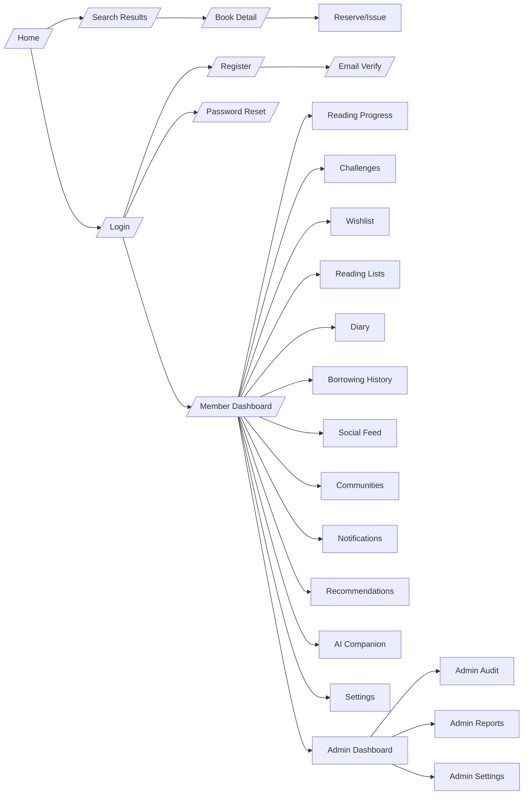
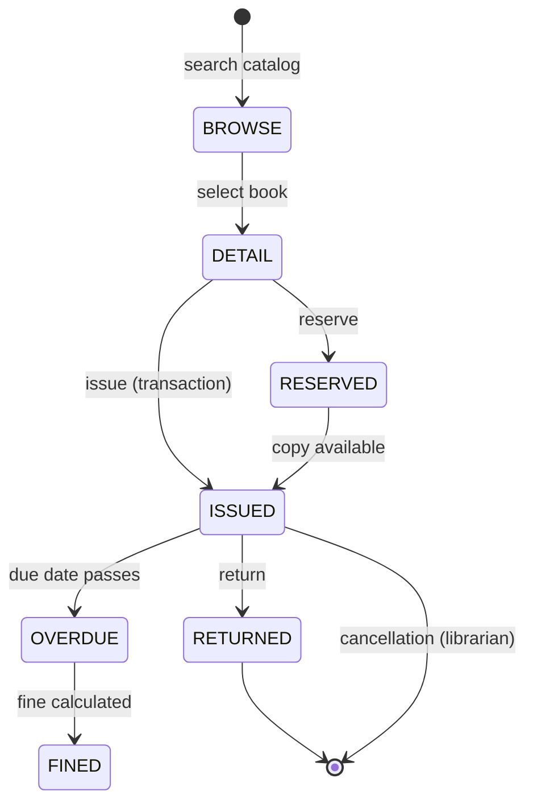
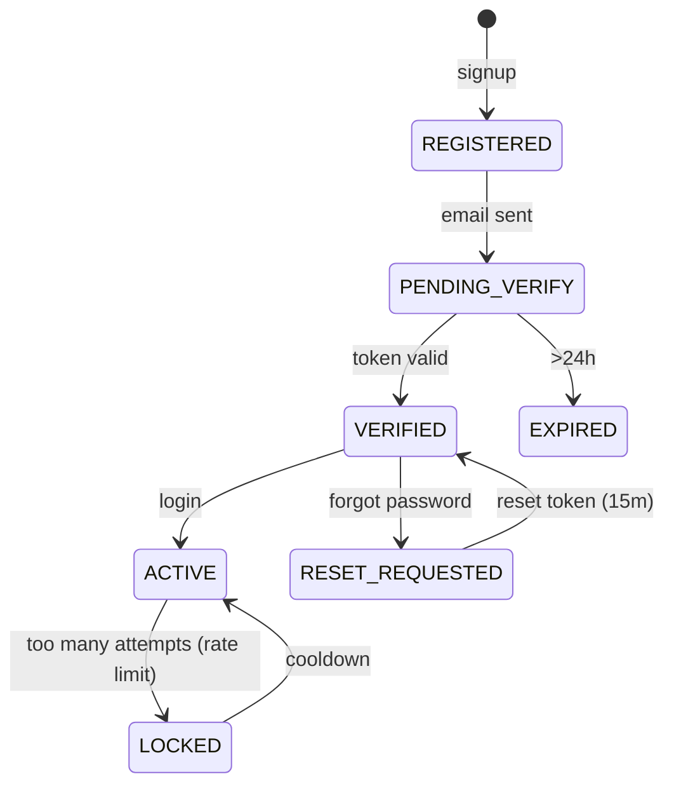

# AppFlow — Book-Tale: Application Flow

| Field | Value |
| --- | --- |
| Version | v0.1 |
| Last Updated | 2026-08-06 |
| Owner | PM / QA |
| Status | In Review |

---

## 1. Screen Inventory

| SCR-### | Screen | Purpose | Entry Points | Exit Points | Auth |
| --- | --- | --- | --- | --- | --- |
| SCR-001 | Home / Landing | Browse catalog, search | `/` | search, login | No |
| SCR-002 | Search Results | Filtered catalog | search | detail, issue | No |
| SCR-003 | Book Detail | Book info, availability | results, recommendations | reserve/issue, review | No |
| SCR-004 | Login | Sign in | nav | dashboard | No |
| SCR-005 | Register | Sign up (role user) | nav | verify | No |
| SCR-006 | Email Verify | Verify token | email link | login | No |
| SCR-007 | Password Reset | Reset via token | login | login | No |
| SCR-008 | Member Dashboard | Loans, fines, progress | login | all member flows | Yes |
| SCR-009 | Reading Progress | Progress, goals, streaks | dashboard | — | Yes |
| SCR-010 | Challenges | Reading challenges | dashboard | — | Yes |
| SCR-011 | Wishlist | Save books | book detail | — | Yes |
| SCR-012 | Reading Lists | Custom lists | dashboard | — | Yes |
| SCR-013 | Social Feed | Posts, comments, likes | nav | — | Yes |
| SCR-014 | Communities | Clubs/groups | feed | — | Yes |
| SCR-015 | Notifications | In-app + realtime | nav | — | Yes |
| SCR-016 | Reviews & Ratings | Book reviews | book detail | — | Yes |
| SCR-017 | Recommendations | "For you" + trending | nav | book detail | Yes |
| SCR-018 | AI Companion | Keyword-intent chat | nav | — | Yes |
| SCR-019 | User Settings | Profile, prefs, theme | dashboard | — | Yes |
| SCR-020 | Admin Dashboard | Member/book mgmt | admin login | all admin | Admin |
| SCR-021 | Admin Audit | Append-only audit trail | admin | — | Admin |
| SCR-022 | Admin Reports | Reports & statistics | admin | — | Admin |
| SCR-023 | Admin Settings | Settings (audited) | admin | — | Admin |
| SCR-024 | Borrowing History | Per-user history | dashboard | — | Yes |
| SCR-025 | Reading Diary | Personal diary | dashboard | — | Yes |
| SCR-026 | Series Tracker | Book series | book detail | — | No |

## 2. Navigation Map

## 3. Detailed Flow per Journey

### Lending loop

### Account lifecycle

## 4. Empty / Loading / Error States

| Screen | Empty | Loading | Error |
| --- | --- | --- | --- |
| Search | "No books found" | skeleton | friendly error + log |
| Feed | "No posts yet" | skeleton | friendly error |
| Notifications | "All caught up" | — | — |
| Borrowing history | "No loans yet" | — | — |
| Admin audit | "No entries" | — | — |
| Detail | — | cover placeholder | 404 book |

## 5. Edge Cases & Branching Logic

| IF condition | THEN route |
| --- | --- |
| Last copy being reserved/issued concurrently | Transaction + check → one wins |
| Member over borrow limit | Block issue with message |
| Membership expired | Block lending, prompt renewal |
| Secret key unset at boot | Refuse to start (fail-fast) |
| Upload non-image renamed `.png` | Reject (magic bytes) |
| Redis down | In-memory rate limiter; bounded pool for jobs |
| Reset token expired (>15m) | Reject, allow re-request |
| Self-registration role > user | Rejected (hard-capped) |

## 6. Notifications & Re-engagement

| Trigger | Channel | Destination |
| --- | --- | --- |
| Book due soon/overdue | Email (cron 09:00) + in-app | member |
| Reserved book available | Socket.IO + in-app | member |
| New like/comment/follow | Socket.IO + in-app | member |
| Token purge sweep | hourly job | system |

## 7. Cross-Platform Deltas

N/A — responsive web app in v1 (no native mobile).

## 8. Related Documents

| Document | Relationship |
| --- | --- |
| [PRD.md](../product/PRD.md) | US-001…008 |
| [TechSpec.md](../technical/TechSpec.md) | Components |
| [Design.md](Design.md) | Screens use components |
| [Schema.md](../technical/Schema.md) | Entities behind screens |
| [ImplementationPlan.md](../project/ImplementationPlan.md) | Tasks |
| [Tracker.md](../project/Tracker.md) | Status |
| [Rules.md](../project/Rules.md) | Standards |
| [API.md](../technical/API.md) | Endpoints |
| [SecurityAndCompliance.md](../technical/SecurityAndCompliance.md) | Security |
| [Testing.md](../technical/Testing.md) | Screen tests |
| [Deployment.md](../technical/Deployment.md) | Environments |
| [Glossary.md](../reference/Glossary.md) | Vocabulary |
| [RiskRegister.md](../project/RiskRegister.md) | Risks |
