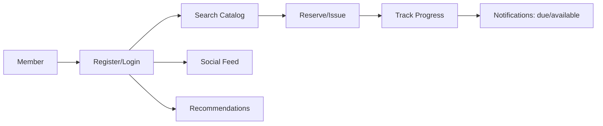

# PRD — Book-Tale: Library Management System

| Field | Value |
| --- | --- |
| Version | v0.1 |
| Last Updated | 2026-08-06 |
| Owner | Product Manager |
| Status | In Review |

---

## 1. Executive Summary

Book-Tale is a full-featured library management system covering catalog, lending, reservations, fines, reading challenges, a social feed, realtime notifications, and book recommendations. Built with Flask + SQLAlchemy + a bundled esbuild frontend, it serves library staff (librarians/admins) and members (readers). It ships with a seeded catalog of 11,127 books, 202 passing tests, and 132 registered routes. The system emphasizes concurrency safety (no overselling the last copy), role-based access, and security hardening.

## 2. Problem Statement

- **User pain:** Small libraries manage catalog, lending, fines, and community features with spreadsheets or disjoint tools. Members lack a unified reading experience (wishlists, challenges, social feed, recommendations).
- **Evidence/context:** 132 routes and 202 tests show the breadth; the seed catalog of 11,127 books powers search, lending, and recommendations.
- **Cost of not solving it:** Oversold copies, lost fines, manual member management, no reader engagement.

## 3. Goals & Non-Goals

| Goal | Metric | Target |
| --- | --- | --- |
| Concurrency-safe lending | No oversell under 20 racing threads | 0 oversells (tested) |
| Member engagement | Reading challenges + social feed active users | ≥ 60% of members (target) |
| Searchable catalog | Catalog search/filter response | p95 < 500ms |
| Operational efficiency | Admin reports accurate | 100% reconciliation |

### Non-Goals (v1)
- Physical inventory / barcode hardware integration.
- Payment gateway for fines (manual reconciliation in v1).
- Real LLM-powered recommendations (v1 is rule-based).
- Public-facing mobile apps (responsive web only).

## 4. Target Users & Personas

| Persona | Role | Goals | Frustrations | Quote | Tech Comfort |
| --- | --- | --- | --- | --- | --- |
| Lina — Librarian | Manages catalog + lending | Fast issue/return, fines | Manual tracking, oversell | "I need the last copy reserved, not double-issued." | Medium |
| Dev — Admin | Runs the library | Audit, reports, settings | Privilege sprawl | "Who changed what, and when?" | High |
| Riya — Member | Reads + engages | Wishlists, challenges, feed | Discovery is hard | "Recommend me my next read." | Medium |
| Sam — Member | Borrows occasionally | Quick search + borrow | Fines surprises | "What do I owe, and when is it due?" | Low |

## 5. User Stories

| ID | As a... | I want... | So that... | Priority | Acceptance Criteria |
| --- | --- | --- | --- | --- | --- |
| US-001 | Member | search/filter catalog | I find books quickly | P0 | Filters: category, availability, author, publisher, ISBN, date, sort |
| US-002 | Librarian | issue/return/reserve in DB transactions | no oversell | P0 | 20-thread concurrency test passes |
| US-003 | Member | track reading progress + challenges | I stay motivated | P1 | Progress + streaks recorded |
| US-004 | Member | social feed with posts/comments/likes | I engage with the community | P1 | Feed CRUD + rate limited |
| US-005 | Admin | audit trail of settings changes | I can prove who changed what | P0 | Append-only audit log with IP + old/new values |
| US-006 | Member | in-app + realtime notifications | I know when books are due/available | P1 | Socket.IO realtime + in-app |
| US-007 | Admin | reports & statistics | I understand usage | P1 | Issuance/returns/fines/active-user reports |
| US-008 | Member | recommendations | I find my next read | P2 | Rule-based "for you" + trending |

## 6. Feature List

| ID | Epic | Feature | Description | Priority | Status |
| --- | --- | --- | --- | --- | --- |
| REQ-001 | Catalog | Search & filtering | Multi-filter catalog search | P0 | Done |
| REQ-002 | Lending | Issue/return/reserve | Transactional lending flows | P0 | Done |
| REQ-003 | Lending | Borrow limits + fines | Limits, expiry, fine calc | P0 | Done |
| REQ-004 | Accounts | Registration/login/logout | bcrypt hashing, `MEM-XXXX` IDs | P0 | Done |
| REQ-005 | Accounts | Email verify + password reset | Expiring tokens (15m/24h) | P0 | Done |
| REQ-006 | Accounts | RBAC roles | user / librarian / admin | P0 | Done |
| REQ-007 | Admin | Dashboard + audit trail | Member/book mgmt, append-only audit | P0 | Done |
| REQ-008 | Social | Feed + communities | Posts, comments, likes, follows | P1 | Done |
| REQ-009 | Reading | Progress + challenges | Streaks, goals, diary | P1 | Done |
| REQ-010 | Realtime | Notifications | Socket.IO realtime + in-app | P1 | Done |
| REQ-011 | Recommendations | Rule-based recommender | History + category affinity + trending | P2 | Done |
| REQ-012 | AI | Reading companion chat | Keyword-intent assistant | P2 | Done |
| REQ-013 | Ops | Health probes | `/healthz`, `/readyz` | P0 | Done |
| REQ-014 | Ops | Background jobs | RQ + Redis: covers, overdue emails, token purge | P0 | Done |

## 7. User Journeys (high level)

## 8. Success Metrics / KPIs

| Metric | Target | Measurement |
| --- | --- | --- |
| North Star: active members per month | ≥ 60% of registered (target) | DB analytics |
| Oversell incidents | 0 | Concurrency test suite |
| Catalog search p95 | < 500ms | Perf report |
| Test health | 202 passing | pytest |
| Fine recovery accuracy | 100% | Reports reconciliation |

## 9. Assumptions & Dependencies

- Redis available for rate limiting, RQ jobs, Socket.IO (graceful degradation to in-memory/bounded pool).
- PostgreSQL in production, SQLite in dev.
- Seed catalog shipped in repo (11,127 books).
- `SECRET_KEY` and `DEFAULT_ADMIN_PASSWORD` must be set (fail-fast boot).

## 10. Risks

Top 3 (full list in ../project/RiskRegister.md):
1. **Privilege escalation** — mitigated by registration role whitelist + security tests.
2. **Oversell under concurrency** — mitigated by DB transactions + 20-thread test.
3. **Redis dependency** — mitigated by bounded fallbacks (rate limit in-memory, bounded worker pool).

## 11. Release Criteria

- [ ] All 202 tests pass (`pytest tests/`).
- [ ] Concurrency test: 20 racing threads, no oversell.
- [ ] Security suite green: privilege escalation, CSRF, rate limits, upload magic bytes.
- [ ] `/healthz` + `/readyz` respond correctly.
- [ ] Docker compose stack boots (app + PG + Redis + worker + nginx).
- [ ] Seed data loads (11,127 books + demo users).

## 12. Open Questions

| Question | Owner | Resolve by |
| --- | --- | --- |
| Move flat `/api/...` routes under `/api/v1/`? | Eng Lead | Release 1.1 |
| Redis-backed Socket.IO queue across workers? | Eng Lead | Release 1.1 |
| Payment integration for fines? | PM | Release 2.0 |

## 13. Related Documents

| Document | Relationship |
| --- | --- |
| [TechSpec.md](../technical/TechSpec.md) | Architecture, stack |
| [AppFlow.md](../design/AppFlow.md) | Screens and journeys |
| [Design.md](../design/Design.md) | Design system |
| [Schema.md](../technical/Schema.md) | Data model |
| [ImplementationPlan.md](../project/ImplementationPlan.md) | Build plan |
| [Tracker.md](../project/Tracker.md) | Task status |
| [Rules.md](../project/Rules.md) | Coding standards |
| [API.md](../technical/API.md) | API surface |
| [SecurityAndCompliance.md](../technical/SecurityAndCompliance.md) | Security posture |
| [Testing.md](../technical/Testing.md) | Test strategy |
| [Deployment.md](../technical/Deployment.md) | Deployment |
| [Glossary.md](../reference/Glossary.md) | Vocabulary |
| [RiskRegister.md](../project/RiskRegister.md) | Risks |
