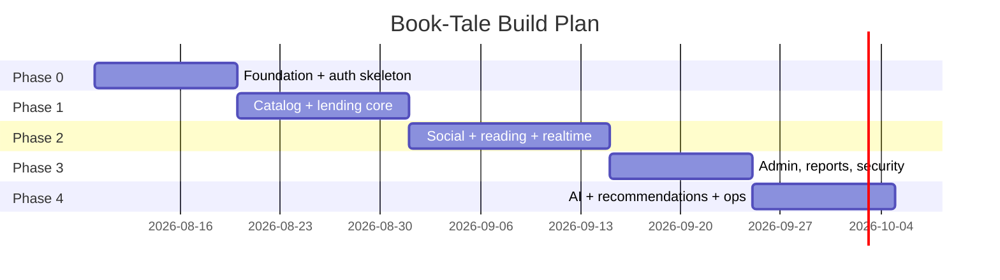
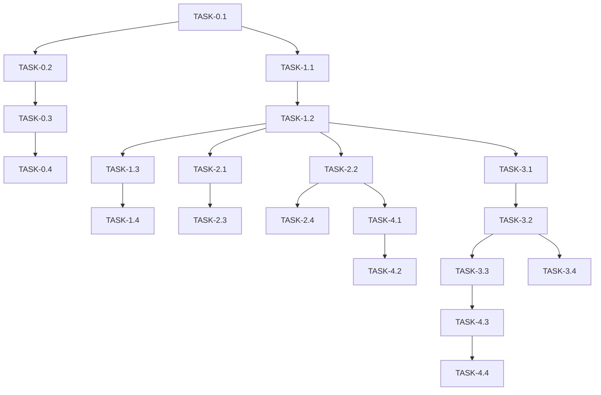

# ImplementationPlan — Book-Tale: Phased Build Plan

| Field | Value |
| --- | --- |
| Version | v0.1 |
| Last Updated | 2026-08-06 |
| Owner | Engineering Lead |
| Status | In Review |

---

## 1. Build Philosophy

Vertical slices on a walking skeleton: get catalog → lend → return working end-to-end first, then layer social, gamification, notifications, and AI. Security hardening (ADR 0001–0010) is interleaved, not bolted on at the end.

## 2. Phase Overview

## 3. Phase Breakdown

### Phase 0: Foundation
- Goal: app boots fail-fast, auth + roles work.
- Exit: login/register/verify/reset flows green.

| TASK-# | Description | Depends on | Owner | Est. | Maps to |
| --- | --- | --- | --- | --- | --- |
| TASK-0.1 | Scaffold Flask app + fail-fast config | — | Eng | 3d | REQ-013 |
| TASK-0.2 | Auth (bcrypt, sessions, CSRF) | TASK-0.1 | Eng | 4d | REQ-004 |
| TASK-0.3 | Email verify + password reset tokens | TASK-0.2 | Eng | 3d | REQ-005 |
| TASK-0.4 | RBAC roles + privilege tests | TASK-0.2 | Eng | 2d | REQ-006 |

### Phase 1: Catalog & Lending
- Goal: search + transactional lending.
- Exit: concurrency test (20 threads) passes.

| TASK-# | Description | Depends on | Owner | Est. | Maps to |
| --- | --- | --- | --- | --- | --- |
| TASK-1.1 | Catalog model + search/filter | TASK-0.1 | Eng | 4d | REQ-001, TBL-book |
| TASK-1.2 | Issue/return/reserve transactions | TASK-1.1 | Eng | 4d | REQ-002 |
| TASK-1.3 | Borrow limits + fines + overdue | TASK-1.2 | Eng | 3d | REQ-003 |
| TASK-1.4 | Concurrency safety + tests | TASK-1.3 | QA | 2d | US-002 |

### Phase 2: Engagement
- Goal: social + reading + realtime.
- Exit: feed, challenges, notifications work.

| TASK-# | Description | Depends on | Owner | Est. | Maps to |
| --- | --- | --- | --- | --- | --- |
| TASK-2.1 | Social feed + communities | TASK-1.2 | Eng | 5d | REQ-008 |
| TASK-2.2 | Reading progress + challenges | TASK-1.2 | Eng | 4d | REQ-009 |
| TASK-2.3 | Notifications + Socket.IO | TASK-2.1 | Eng | 4d | REQ-010 |
| TASK-2.4 | Wishlist, lists, diary, series | TASK-2.2 | Eng | 3d | SCR-011/012/025/026 |

### Phase 3: Admin & Security
- Goal: audit trail, reports, hardening.
- Exit: security suite (90 tests) green.

| TASK-# | Description | Depends on | Owner | Est. | Maps to |
| --- | --- | --- | --- | --- | --- |
| TASK-3.1 | Admin dashboard + member/book mgmt | TASK-1.2 | Eng | 4d | REQ-007 |
| TASK-3.2 | Append-only audit trail | TASK-3.1 | Eng | 3d | REQ-007, TBL-audit_entry |
| TASK-3.3 | Reports & statistics | TASK-3.1 | Eng | 3d | US-007 |
| TASK-3.4 | Security hardening pass | TASK-3.2 | Security | 4d | SecurityAndCompliance |

### Phase 4: AI & Ops
- Goal: recommendations, AI chat, background jobs.
- Exit: RQ jobs + cron verified.

| TASK-# | Description | Depends on | Owner | Est. | Maps to |
| --- | --- | --- | --- | --- | --- |
| TASK-4.1 | Rule-based recommender | TASK-2.2 | Eng | 3d | REQ-011 |
| TASK-4.2 | AI reading companion (keyword intent) | TASK-4.1 | Eng | 3d | REQ-012 |
| TASK-4.3 | RQ jobs + cron (covers, emails, purge) | TASK-3.3 | Eng | 3d | REQ-014 |
| TASK-4.4 | Health probes + structured logging | TASK-4.3 | Eng | 2d | REQ-013 |

## 4. Dependency Graph

## 5. Environment & Tooling Setup Checklist

- [ ] `pip install -r requirements.txt`
- [ ] `SECRET_KEY` + `DEFAULT_ADMIN_PASSWORD` env vars set (fail-fast)
- [ ] Redis running (rate limiter, RQ)
- [ ] `python seed_data.py` (11,127 books) + `python seed_users.py`
- [ ] `pytest tests/` green (202)
- [ ] esbuild frontend build: `node scripts/build_frontend.mjs`

## 6. Rollout Strategy

- Feature flags: none in v1 (all features shipped on).
- Canary: deploy to staging, run smoke checklist (`SMOKE_TEST.md`), then prod.
- Rollback: docker-compose image revert; runbooks in `docs/runbooks/`.

## 7. Definition of Done (global)

- [ ] Tests written + passing (unit/integration/security as applicable)
- [ ] Docs updated (this suite + ADR if decision)
- [ ] Reviewed by 1+ peer
- [ ] Security: no secrets, magic-byte uploads, CSRF on state changes
- [ ] Accessibility checked for UI changes

## 8. Related Documents

| Document | Relationship |
| --- | --- |
| [PRD.md](../product/PRD.md) | REQ/US mapping |
| [TechSpec.md](../technical/TechSpec.md) | Components |
| [AppFlow.md](../design/AppFlow.md) | Screens/flows |
| [Schema.md](../technical/Schema.md) | Data model |
| [Design.md](../design/Design.md) | UI tasks |
| [Tracker.md](Tracker.md) | Live status |
| [Rules.md](Rules.md) | Standards |
| [API.md](../technical/API.md) | Contract |
| [SecurityAndCompliance.md](../technical/SecurityAndCompliance.md) | Security tasks |
| [Testing.md](../technical/Testing.md) | Test plan |
| [Deployment.md](../technical/Deployment.md) | Rollout |
| [Glossary.md](../reference/Glossary.md) | Vocabulary |
| [RiskRegister.md](RiskRegister.md) | Risks |
