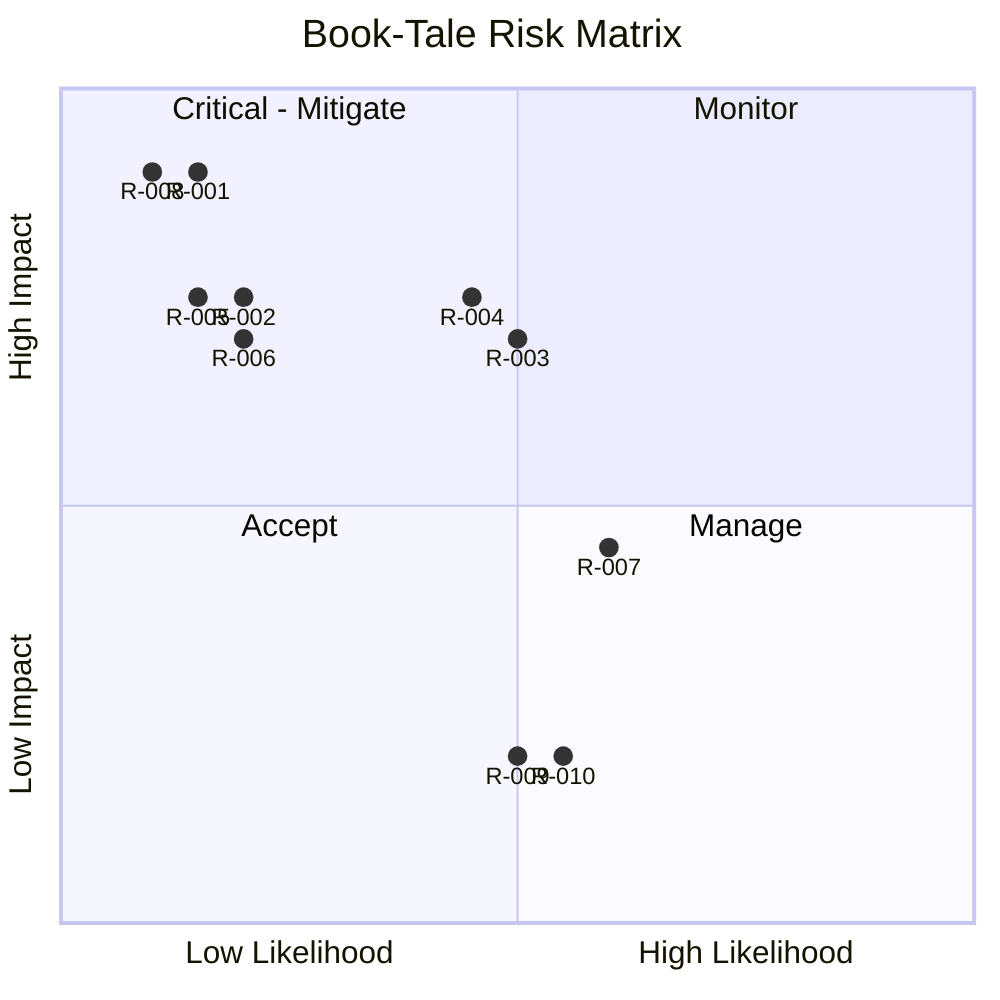

# RiskRegister — Book-Tale: Known Risks

| Field | Value |
| --- | --- |
| Version | v0.1 |
| Last Updated | 2026-08-06 |
| Owner | PM / Eng Lead |
| Status | In Review |

---

| Risk | Likelihood | Impact | Score | Mitigation | Owner | Status |
| --- | --- | --- | --- | --- | --- | --- |
| R-001 Privilege escalation | Low | Critical | 8 | Role whitelist + regression tests (TC-002) | Security | Mitigating |
| R-002 Oversell under concurrency | Low | High | 6 | Transactions + 20-thread test | Eng | Mitigating |
| R-003 Redis outage | Medium | Medium | 6 | In-memory limiter + bounded pool (ADR 0010) | Eng | Mitigating |
| R-004 XSS via user content | Medium | High | 6 | Autoescape, CSP, sanitization | Security | Mitigating |
| R-005 CSRF forgery | Low | High | 5 | Flask-WTF everywhere + tests | Security | Mitigating |
| R-006 Upload payload smuggling | Low | High | 5 | Magic-byte + re-encode + allow-list | Security | Mitigating |
| R-007 Slow test suite / CI timeouts | Medium | Medium | 4 | Tag slow tests, split suites | QA | 🔴 Open (BLK-001) |
| R-008 Default-secret boot | Low | Critical | 8 | Fail-fast + tests | Security | Mitigating |
| R-009 LLM/rec claims mismatch | Medium | Low | 2 | Honest labeling (rule-based ≠ ML) | PM | Accepted |
| R-010 Redis-backed Socket.IO multi-worker | Medium | Low | 2 | Documented roadmap; single-process dev | Eng | Accepted |

## Risk Matrix

## Related Documents

| Document | Relationship |
| --- | --- |
| [PRD.md](../product/PRD.md) | Top-3 risks |
| [SecurityAndCompliance.md](../technical/SecurityAndCompliance.md) | R-001/004/005/006/008 |
| [TechSpec.md](../technical/TechSpec.md) | R-003 |
| [AppFlow.md](../design/AppFlow.md) | Flows |
| [Design.md](../design/Design.md) | Design |
| [Schema.md](../technical/Schema.md) | Data |
| [ImplementationPlan.md](ImplementationPlan.md) | Mitigations |
| [Tracker.md](Tracker.md) | BLK-001 |
| [Rules.md](Rules.md) | Standards |
| [API.md](../technical/API.md) | Endpoints |
| [Testing.md](../technical/Testing.md) | Test coverage |
| [Deployment.md](../technical/Deployment.md) | Rollback |
| [Glossary.md](../reference/Glossary.md) | Vocabulary |
