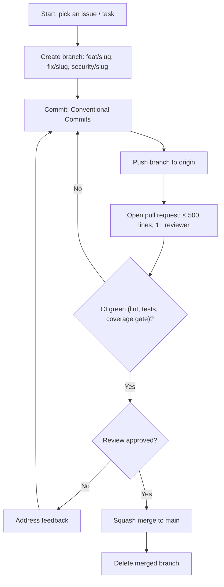

# Rules — Book-Tale: Coding Standards & AI-Agent Operating Rules

| Field | Value |
| --- | --- |
| Version | v0.1 |
| Last Updated | 2026-08-06 |
| Owner | Engineering Lead |
| Status | In Review |

---

## 1. Guiding Principles

1. Readability over cleverness.
2. No silent failures — every exception logged with request ID.
3. Security is non-negotiable — CSRF, rate limits, magic-byte uploads.
4. Small PRs only.
5. Tests accompany every behavior change (unit + security where relevant).
6. Concurrency safety on any money/inventory mutation.
7. Docs updated in the same PR as behavior changes.

## 2. Code Style

- Python 3.10+, type hints required.
- Formatter: black; linter: ruff; isort.
- Structure:

```
web_app.py / main.py / start.py / worker.py   # thin entry points
app/
  config/      # settings, fail-fast validation
  core/        # exceptions, logger, utils
  models/      # domain dataclasses
  storage/     # legacy JSON persistence
  db/          # SQLAlchemy: storage_adapter, models, repositories, service
  routes/      # web_app, page_routes, social_routes, new_features_routes
  services/    # auth, books, social, notifications, recommendations, reading
  jobs/        # RQ tasks, jobs, worker
  realtime/    # Socket.IO
  api/         # OpenAPI spec
  templates/   # Jinja2
  static/      # js/css + dist (esbuild)
migrations/    # Alembic
scripts/       # build_frontend.mjs, seed_*, benchmark
tests/         # unit + security suites
```

## 3. Git Workflow

- Branches: `feat/<slug>`, `fix/<slug>`, `security/<slug>`.
- Commits: Conventional Commits.
- PRs: ≤ 500 lines, 1+ reviewer, CI green (lint + tests + coverage gate).
- Merge: squash to main.

## 4. Testing Requirements

- Coverage gate: ≥ 85% line coverage on the `db` data layer (`--cov=db --cov-fail-under=85`).
- MUST have tests: lending concurrency, privilege escalation, CSRF, rate limits, upload magic bytes, audit trail, token lifecycle.
- See [Testing.md](../technical/Testing.md).

## 5. AI Agent Operating Rules

- Always read Tracker.md and ImplementationPlan.md before starting a task.
- Never mark a task 🟢 Done without tests passing.
- Never invent requirements not in ../product/PRD.md/../technical/TechSpec.md — flag ambiguity.
- Always update ../technical/Schema.md when a migration changes the data model.
- Never commit secrets; env vars per ../technical/SecurityAndCompliance.md.
- Always cross-check ../design/Design.md before building UI components.
- State conflicts rather than silently picking a side.

## 6. Security Baseline Rules

- CSRF enabled on all state-changing endpoints (Flask-WTF).
- Rate limits on auth + engagement endpoints (Flask-Limiter).
- Passwords ≥ 12 chars, bcrypt.
- Uploads: magic-byte verified + server re-encode + allow-list + size cap.
- No raw SQL string concatenation.
- Secrets from env only; fail-fast on unset/default SECRET_KEY.
- Dependency scanning cadence: weekly.

## 7. Documentation Rules

- Schema change → same-PR ../technical/Schema.md update.
- New endpoint → same-PR ../technical/API.md update.
- New decision → ADR in docs/adr/.
- New env var → ../technical/Deployment.md update.

## 8. Prohibited Patterns

| Anti-pattern | Why |
| --- | --- |
| `except Exception: pass` | Silent failure (except audit path) |
| Raw SQL with f-strings | SQL injection |
| Trusting upload extension alone | Magic-byte bypass |
| Hardcoding SECRET_KEY | Trivial compromise |
| State changes without CSRF token | CSRF |
| Per-process `hash()` randomness for avatars | Nondeterministic UI |

## 9. Escalation Rules

**Ask a human when:** schema-breaking migrations, security incidents, rate-limit policy changes, scope changes, Redis dependency changes.
**Decide autonomously:** refactors within a service, new tests, logging, small bug fixes.

## Git / PR Workflow



## 10. Related Documents

| Document | Relationship |
| --- | --- |
| [Testing.md](../technical/Testing.md) | Test requirements |
| [SecurityAndCompliance.md](../technical/SecurityAndCompliance.md) | Security baseline |
| [PRD.md](../product/PRD.md) | Requirements |
| [TechSpec.md](../technical/TechSpec.md) | Architecture |
| [AppFlow.md](../design/AppFlow.md) | Flows |
| [Design.md](../design/Design.md) | Design system |
| [Schema.md](../technical/Schema.md) | Data model |
| [ImplementationPlan.md](ImplementationPlan.md) | Tasks |
| [Tracker.md](Tracker.md) | Status |
| [API.md](../technical/API.md) | Contract |
| [Deployment.md](../technical/Deployment.md) | Env vars |
| [Glossary.md](../reference/Glossary.md) | Vocabulary |
| [RiskRegister.md](RiskRegister.md) | Risks |
