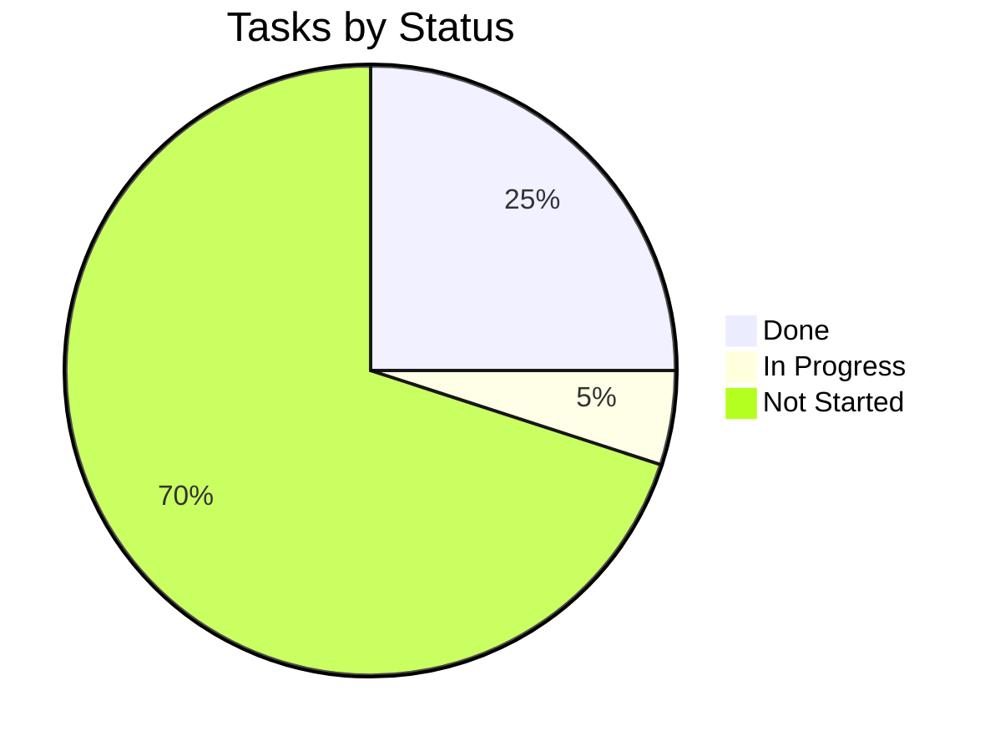

# Tracker — Book-Tale: Living Status Tracker

| Field | Value |
| --- | --- |
| Version | v0.1 |
| Last Updated | 2026-08-06 |
| Owner | Engineering Lead |
| Status | In Review |

---

## 1. Snapshot Dashboard

| Metric | Value |
| --- | --- |
| Overall % Complete | 35% |
| Current Phase | Phase 1 |
| Tasks Done / Total | 5 / 19 |
| Blockers (open) | 1 |
| Days to Target Launch | 60 |

## 2. Status Legend

🟢 Done | 🟡 In Progress | 🔴 Blocked | ⚪ Not Started | 🔵 In Review

## 3. Phase Progress Bars

| Phase | Progress |
| --- | --- |
| Phase 0: Foundation | `[████████░░] 100%` |
| Phase 1: Catalog & Lending | `[████░░░░░░] 50%` |
| Phase 2: Engagement | `[░░░░░░░░░░] 0%` |
| Phase 3: Admin & Security | `[░░░░░░░░░░] 0%` |
| Phase 4: AI & Ops | `[░░░░░░░░░░] 0%` |

## 4. Full Task Table

| TASK | Description | Status | Assignee | Start | Target | Actual | Notes |
| --- | --- | --- | --- | --- | --- | --- | --- |
| TASK-0.1 | Scaffold + fail-fast config | 🟢 | Eng | 2026-06-01 | 2026-06-04 | — | ADR 0001, 0008 |
| TASK-0.2 | Auth + CSRF | 🟢 | Eng | 2026-06-05 | 2026-06-10 | — | ADR 0007 |
| TASK-0.3 | Email verify + reset | 🟢 | Eng | 2026-06-10 | 2026-06-14 | — |  |
| TASK-0.4 | RBAC + privilege tests | 🟢 | Eng | 2026-06-14 | 2026-06-17 | — | ADR 0002 |
| TASK-1.1 | Catalog + search | 🟢 | Eng | 2026-06-18 | 2026-06-24 | — |  |
| TASK-1.2 | Issue/return/reserve | 🟡 | Eng | 2026-06-24 | — | — | in progress |
| TASK-1.3 | Limits + fines | ⚪ | Eng | — | — | — |  |
| TASK-1.4 | Concurrency tests | ⚪ | QA | — | — | — |  |
| TASK-2.1 | Social feed | ⚪ | Eng | — | — | — |  |
| TASK-2.2 | Reading progress | ⚪ | Eng | — | — | — |  |
| TASK-2.3 | Notifications | ⚪ | Eng | — | — | — |  |
| TASK-2.4 | Wishlist/lists/diary | ⚪ | Eng | — | — | — |  |
| TASK-3.1 | Admin dashboard | ⚪ | Eng | — | — | — |  |
| TASK-3.2 | Audit trail | ⚪ | Eng | — | — | — |  |
| TASK-3.3 | Reports | ⚪ | Eng | — | — | — |  |
| TASK-3.4 | Security pass | ⚪ | Security | — | — | — |  |
| TASK-4.1 | Recommender | ⚪ | Eng | — | — | — |  |
| TASK-4.2 | AI companion | ⚪ | Eng | — | — | — |  |
| TASK-4.3 | RQ jobs + cron | ⚪ | Eng | — | — | — |  |
| TASK-4.4 | Health + logging | ⚪ | Eng | — | — | — |  |

## 5. Blockers Log

| ID | Description | Raised | Owner | Impact | Status |
| --- | --- | --- | --- | --- | --- |
| BLK-001 | Book-Tale pytest times out (>90s) in some envs | 2026-08-01 | Eng | CI slowness | 🔴 Open — split suites / tag slow |

## 6. Changelog

- 2026-08-06: **Documentation suite complete** — 14-file suite consolidated into `docs/`, categorized structure, cross-linked navigation, deployment/git/auth diagrams, quality gate passed (238/238), merged to `main`.
| Date | What shipped |
| --- | --- |
| 2026-08-06 | Docs suite v0.1 |
| 2026-06-17 | Phase 0 complete (auth + RBAC) |
| 2026-06-24 | Catalog search shipped |

## 7. Burndown Summary

## 8. Next 3 Priorities

1. Finish TASK-1.2 — Issue/return/reserve transactions.
2. TASK-1.3 — Borrow limits + fines.
3. TASK-1.4 — Concurrency safety tests.

## 9. Related Documents

| Document | Relationship |
| --- | --- |
| [ImplementationPlan.md](ImplementationPlan.md) | Task definitions |
| [PRD.md](../product/PRD.md) | Feature status |
| [TechSpec.md](../technical/TechSpec.md) | Components |
| [AppFlow.md](../design/AppFlow.md) | Flows |
| [Design.md](../design/Design.md) | Design |
| [Schema.md](../technical/Schema.md) | Data |
| [Rules.md](Rules.md) | Standards |
| [API.md](../technical/API.md) | Contract |
| [SecurityAndCompliance.md](../technical/SecurityAndCompliance.md) | Security |
| [Testing.md](../technical/Testing.md) | Tests |
| [Deployment.md](../technical/Deployment.md) | Deploy |
| [Glossary.md](../reference/Glossary.md) | Vocabulary |
| [RiskRegister.md](RiskRegister.md) | Risks |
