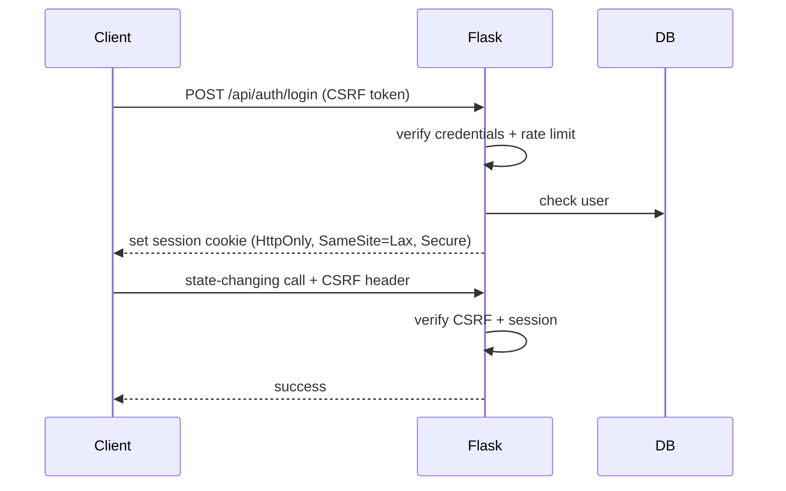

# API — Book-Tale: API Reference

| Field | Value |
| --- | --- |
| Version | v0.1 |
| Last Updated | 2026-08-06 |
| Owner | Backend Engineer |
| Status | In Review |

---

> Live OpenAPI 3.1 spec served at `/api/openapi.json`, rendered by Swagger UI at `/api/docs`. This file documents the envelope and key endpoints; the generated spec is authoritative.

## 1. Envelope

- Success: `{"success": true, ...}` or `{"data": ..., ...}`
- Error (API paths): `{"data": null, "error": {"code": "...", "message": "..."}}`
- Status codes: 400/401/403/404/405/413/415/422/429/500.

## 2. Endpoint Inventory (representative)

| Method | Path | Auth | Description |
| --- | --- | --- | --- |
| POST | `/api/auth/login` | No | Login (rate limited) |
| POST | `/api/auth/logout` | Yes | Logout |
| POST | `/api/ai/chat` | Yes | AI reading companion (30/min) |
| GET | `/api/notifications` | Yes | In-app notifications |
| POST | `/api/social/post` | Yes | Create post (30/min) |
| POST | `/api/social/like` | Yes | Like (60/min) |
| POST | `/api/social/follow` | Yes | Follow (60/min) |
| GET | `/api/recommendations/for-you` | Yes | Rule-based recommendations |
| POST | `/api/settings/notifications` | Yes | Notification prefs |
| GET | `/healthz` | No | Liveness |
| GET | `/readyz` | No | Readiness (DB) |
| GET | `/api/docs` | No | Swagger UI |
| GET | `/api/openapi.json` | No | OpenAPI 3.1 spec |

## 3. Example: POST /api/ai/chat

Request: `{"message": "recommend a thriller like 1984"}`
Response: `{"success": true, "reply": "...", "sources": [...]}`

## 4. Rate Limits (summary)

| Surface | Limit |
| --- | --- |
| Login (POST) | 10/min per IP (failed attempts counted) |
| Register/forgot/reset | 5/min |
| Content spam (posts, comments, reviews…) | 30/min |
| Engagement (likes, follows, votes…) | 60/min |
| AI chat | 30/min |
| Global default | 200/min |

## 5. Versioning Policy

- Flat `/api/...` in v1; roadmap: move under `/api/v1/` with `{data, error, meta}` envelope everywhere.

## 6. Auth Flow

## 7. Related Documents

| Document | Relationship |
| --- | --- |
| [TechSpec.md](TechSpec.md) | API layer |
| [Schema.md](Schema.md) | Tables behind endpoints |
| [SecurityAndCompliance.md](SecurityAndCompliance.md) | Auth + rate limits |
| [AppFlow.md](../design/AppFlow.md) | Screens calling endpoints |
| [PRD.md](../product/PRD.md) | Requirements |
| [Design.md](../design/Design.md) | Response rendering |
| [ImplementationPlan.md](../project/ImplementationPlan.md) | Tasks |
| [Tracker.md](../project/Tracker.md) | Status |
| [Rules.md](../project/Rules.md) | Standards |
| [Testing.md](Testing.md) | Contract tests |
| [Deployment.md](Deployment.md) | Deploy |
| [Glossary.md](../reference/Glossary.md) | Vocabulary |
| [RiskRegister.md](../project/RiskRegister.md) | Risks |
