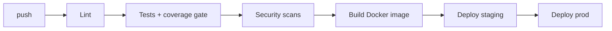

# Deployment — Book-Tale: Environments, CI/CD, Rollback

| Field | Value |
| --- | --- |
| Version | v0.1 |
| Last Updated | 2026-08-06 |
| Owner | DevOps Engineer |
| Status | In Review |

---

## 1. Service Topology

| Service | Base | Purpose | Port |
| --- | --- | --- | --- |
| app | multi-stage Docker (gunicorn) | Flask app | 5000 |
| worker | python worker.py | RQ + cron scheduler | — |
| postgres | postgres:16 | DB | 5432 |
| redis | redis:7 | rate limits, RQ, Socket.IO | 6379 |
| nginx | nginx | reverse proxy | 80 |

## 2. CI/CD Pipeline

## 3. Environment Promotion

| Step | From | To | Trigger |
| --- | --- | --- | --- |
| 1 | main | staging | CI green |
| 2 | staging | prod | manual approval + smoke checklist |

## 4. Rollback Procedure

- Image revert (docker-compose) + `alembic downgrade` only if schema rolled back intentionally.
- Runbooks: docs/runbooks/ (deploy, rollback, restore-from-backup, rotate-secret-key, incident).

## 5. Feature Flag Policy

- No runtime feature flags in v1; env-driven configuration only.
- `CRON_OVERDUE_EMAILS`, `CRON_TOKEN_PURGE`, `COVER_FETCH_WORKERS` env-tunable.

## 6. On-Call / Runbook Basics

- **Not booting:** check SECRET_KEY/DEFAULT_ADMIN_PASSWORD set (fail-fast).
- **DB errors:** check PG reachability; `/readyz` shows DB status.
- **Jobs not running:** check Redis + worker service; bounded pool fallback logs.
- **Slow search:** see roadmap (indexed SQL / FTS).

## 7. Related Documents

| Document | Relationship |
| --- | --- |
| [TechSpec.md](TechSpec.md) | Environment matrix |
| [SecurityAndCompliance.md](SecurityAndCompliance.md) | Secret mgmt |
| [PRD.md](../product/PRD.md) | Release criteria |
| [AppFlow.md](../design/AppFlow.md) | Flows |
| [Schema.md](Schema.md) | Migrations |
| [Design.md](../design/Design.md) | Asset pipeline |
| [ImplementationPlan.md](../project/ImplementationPlan.md) | Rollout |
| [Tracker.md](../project/Tracker.md) | Status |
| [Rules.md](../project/Rules.md) | Standards |
| [API.md](API.md) | Endpoints |
| [Testing.md](Testing.md) | CI gates |
| [Glossary.md](../reference/Glossary.md) | Vocabulary |
| [RiskRegister.md](../project/RiskRegister.md) | Risks |
