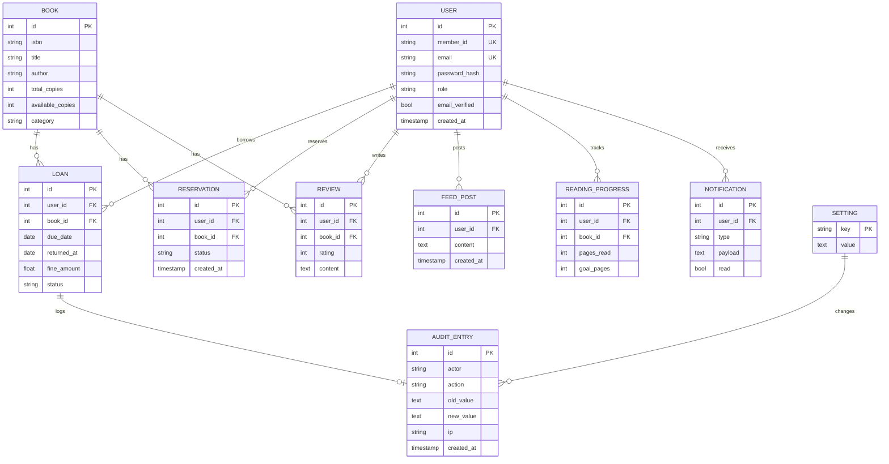

# Schema — Book-Tale: Data Model & Database Design

| Field | Value |
| --- | --- |
| Version | v0.1 |
| Last Updated | 2026-08-06 |
| Owner | Backend Engineer |
| Status | In Review |

---

> This file documents the core entities as implemented by `app/db/models.py`. Representative subset — the full ORM is authoritative.

## 1. ER Diagram



## 2. Table/Collection Definitions

### TBL-user
| Field | Type | Nullable | Default | Constraints | Description |
| --- | --- | --- | --- | --- | --- |
| id | int PK | No | auto | — | PK |
| member_id | string | No | — | unique, `MEM-XXXX` | public id |
| email | string | No | — | unique | login |
| password_hash | string | No | — | bcrypt | password |
| role | enum | No | user | user/librarian/admin | role |
| email_verified | bool | No | false | — | verified flag |
| created_at | timestamp | No | now() | — | signup |

### TBL-book
| Field | Type | Nullable | Default | Constraints | Description |
| --- | --- | --- | --- | --- | --- |
| id | int PK | No | auto | — | PK |
| isbn | string | Yes | — | unique | ISBN |
| title | string | No | — | — | title |
| author | string | Yes | — | — | author |
| total_copies | int | No | 1 | ≥ 0 | copies owned |
| available_copies | int | No | total | ≥ 0, ≤ total | copies free |
| category | string | Yes | — | — | category |

### TBL-loan
| Field | Type | Nullable | Default | Constraints | Description |
| --- | --- | --- | --- | --- | --- |
| id | int PK | No | auto | — | PK |
| user_id | int FK | No | — | → user | borrower |
| book_id | int FK | No | — | → book | book |
| due_date | date | No | — | — | return-by |
| returned_at | date | Yes | — | — | actual return |
| fine_amount | float | No | 0 | ≥ 0 | calculated fine |
| status | enum | No | active | active/returned/overdue | loan state |

### TBL-audit_entry
| Field | Type | Nullable | Default | Constraints | Description |
| --- | --- | --- | --- | --- | --- |
| id | int PK | No | auto | — | PK |
| actor | string | No | — | — | who (user id) |
| action | string | No | — | — | what |
| old_value | text | Yes | — | secrets redacted `[redacted]` | before |
| new_value | text | Yes | — | secrets redacted | after |
| ip | string | Yes | — | — | source IP |
| created_at | timestamp | No | now() | — | when |

## 3. Relationships & Foreign Keys

| Table A | Table B | On delete | Justification |
| --- | --- | --- | --- |
| loan | user | restrict | history preserved |
| loan | book | restrict | history preserved |
| reservation | user/book | cascade | transient data |
| review | user/book | cascade | content removed with owner |
| audit_entry | setting | none (log row) | append-only |

## 4. Indexes

| Table | Index | Columns | Type | Reason |
| --- | --- | --- | --- | --- |
| book | idx_book_title | (title) | btree | search |
| book | idx_book_category | (category) | btree | filter |
| loan | idx_loan_user_status | (user_id, status) | btree | member history |
| loan | idx_loan_due | (due_date) | btree | overdue scans |
| audit_entry | idx_audit_created | (created_at) | btree | pagination/search |
| notification | idx_notif_user_read | (user_id, read) | btree | badge count |

## 5. Enums / Constants

| Enum | Allowed values |
| --- | --- |
| user.role | user, librarian, admin |
| loan.status | active, returned, overdue |
| reservation.status | pending, fulfilled, cancelled |
| notification.type | loan_due, reservation_available, social, system |
| fine rate | ₹5/day (config) |

## 6. Data Lifecycle

- Soft-delete: users/book can be archived (flagged) rather than destroyed.
- Retention: audit entries append-only, retained indefinitely.
- Purge: expired auth tokens purged hourly (`CRON_TOKEN_PURGE`); verification/reset tokens single-use with 15m/24h TTL.

## 7. Migrations Strategy

- Tool: Alembic, versions in `migrations/versions/`.
- Naming: `<rev>_<slug>.py` (ADR-documented).
- Rollback: `alembic downgrade -1`; round-trip tested.

## 8. Sample Records

```json
{
  "user": { "member_id": "MEM-0001", "email": "riya@lib.org", "role": "user", "email_verified": true },
  "book": { "isbn": "9780141036144", "title": "1984", "author": "George Orwell", "total_copies": 3, "available_copies": 1 },
  "loan": { "user_id": 1, "book_id": 10, "due_date": "2026-08-20", "status": "active", "fine_amount": 0 }
}
```

## 9. Data Validation Rules

| Field | DB constraint | App layer |
| --- | --- | --- |
| user.email | unique | regex + Pydantic |
| user.password_hash | — | policy ≥ 12 chars |
| book.available_copies | ≥ 0 | transaction check on issue |
| loan.due_date | — | computed from borrow window |
| audit old/new | — | secret redaction before store |

## 10. Sensitive Data Map

| Field | Sensitivity | Encrypted at rest? | Masked in logs? |
| --- | --- | --- | --- |
| password_hash | credential | bcrypt | never logged |
| email | PII | — | truncated in logs |
| reset/verify tokens | credential | hashed (DB-backed) | — |
| audit old/new values | internal | — | secrets → `[redacted]` |
| loan/reading data | none | — | — |

## 11. Related Documents

| Document | Relationship |
| --- | --- |
| [API.md](API.md) | Endpoints touching these tables |
| [TechSpec.md](TechSpec.md) | Storage adapter |
| [PRD.md](../product/PRD.md) | Requirements |
| [AppFlow.md](../design/AppFlow.md) | Screens using entities |
| [Design.md](../design/Design.md) | Display fields |
| [ImplementationPlan.md](../project/ImplementationPlan.md) | Tasks |
| [Tracker.md](../project/Tracker.md) | Status |
| [Rules.md](../project/Rules.md) | Standards |
| [SecurityAndCompliance.md](SecurityAndCompliance.md) | Sensitive data |
| [Testing.md](Testing.md) | Data tests |
| [Deployment.md](Deployment.md) | Migrations |
| [Glossary.md](../reference/Glossary.md) | Vocabulary |
| [RiskRegister.md](../project/RiskRegister.md) | Risks |
