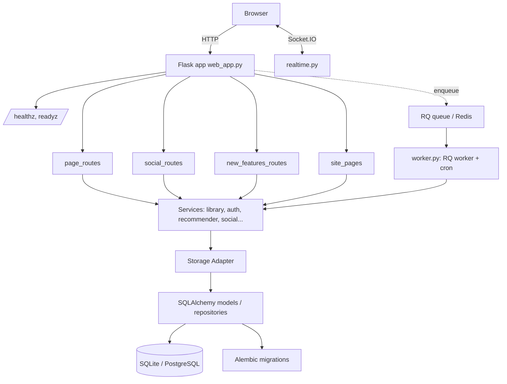
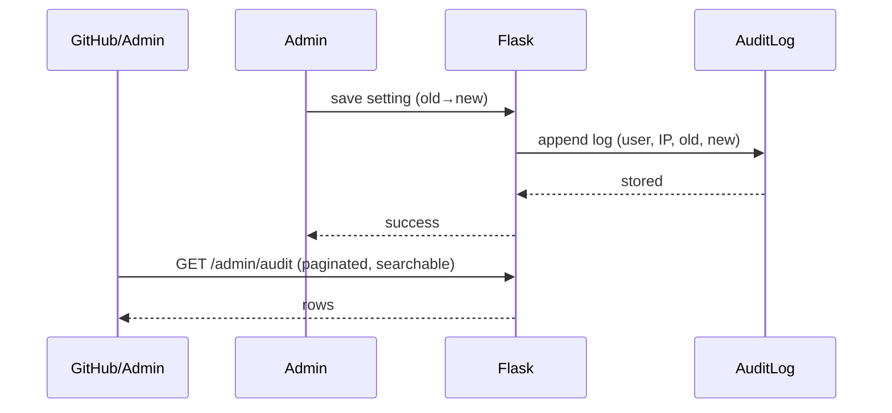
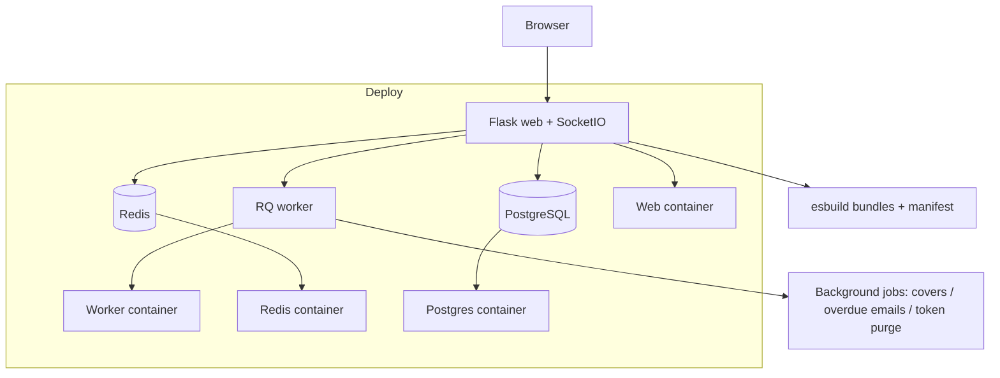

# TechSpec — Book-Tale: Technical Specification

| Field | Value |
| --- | --- |
| Version | v0.1 |
| Last Updated | 2026-08-06 |
| Owner | Engineering Lead |
| Status | In Review |

---

## 1. Architecture Overview



## 2. Tech Stack Table

| Layer | Technology | Version | Justification |
| --- | --- | --- | --- |
| Web framework | Flask | 3.x | Mature, 132 routes, batteries |
| ORM | SQLAlchemy | 2.x | Typed models, repositories |
| Migrations | Alembic | 1.x | Versioned schema |
| Templates | Jinja2 | 3.x | Autoescape ON, macro library |
| Frontend build | esbuild | — | Content-hashed bundles, manifest |
| Realtime | Flask-SocketIO | 5.x | Live notifications |
| Background jobs | RQ + Redis | — | Durable queue; bounded pool fallback |
| Auth | Session + bcrypt + Flask-WTF | — | Signed cookies, CSRF |
| Rate limiting | Flask-Limiter | 3.x | Redis-backed; in-memory fallback |
| Logging | stdlib + RotatingFileHandler | — | JSON lines, request IDs |
| Testing | pytest | 8.x | Unit + integration + security |
| Infra | Docker + docker-compose | — | app + PG + Redis + worker + nginx |

## 3. System Components

| Component | Responsibility | Inputs → Outputs | Scaling | Failure Modes |
| --- | --- | --- | --- | --- |
| Flask app | HTTP, security headers, request ID, CSRF, rate limits | request → response | gunicorn workers | boot fails w/o SECRET_KEY (by design) |
| Route modules | Feature endpoints | request → services | in-process | none |
| Services layer | Business logic | args → result | in-process | domain errors → HTTP 4xx |
| Storage adapter | Owns SQLAlchemy session | service calls → rows | in-process | DB down → /readyz fails |
| RQ worker | Covers, overdue emails, token purge | job → effect | add workers | Redis down → bounded pool fallback |
| Realtime | Socket.IO events | event → clients | Redis MQ (future) | single-process only today |
| Frontend | Jinja2 + esbuild JS | HTTP/WS → UI | static assets | CDN fallbacks |

## 4. Data Flow Diagrams

```mermaid
sequenceDiagram
    participant M as Member
    participant F as Flask
    participant S as Services
    participant DB as DB
    M->>F: POST /issue (book_id)
    F->>S: issue_book(book_id, user)
    S->>DB: BEGIN; check stock; INSERT loan; COMMIT
    DB-->>S: ok
    S-->>F: success
    F-->>M: confirmation
```



## 5. Third-Party Integrations

| Service | Purpose | Failure Fallback | Cost Model | Rate Limits |
| --- | --- | --- | --- | --- |
| Redis | Rate limits, RQ, Socket.IO | in-memory limiter; bounded worker pool | self-hosted | n/a |
| SMTP (email) | Verification, reset, overdue reminders | logged failure | provider | provider |
| External cover fetch | Book cover metadata | enqueued retry / skip | provider | provider |
| Google Books/ISBN (cover) | Cover images | none (placeholder) | free tier | quota |

## 6. Non-Functional Requirements

| Category | Requirement | Target | How Verified |
| --- | --- | --- | --- |
| Performance | Catalog search | p95 < 500ms | perf report |
| Availability | Boot refuses insecure defaults | fail-fast on bad SECRET_KEY | startup test |
| Scalability | Concurrency-safe lending | 0 oversell at 20 threads | concurrency tests |
| Security | OWASP-aligned headers + CSRF + rate limits | all responses | security suite (90 tests) |
| Observability | JSON structured logs + request IDs | all requests | log inspection |

## 7. Environments

| Env | URL | Data | Deploy | Access |
| --- | --- | --- | --- | --- |
| dev | localhost:5000 | SQLite + seed | manual | developer |
| staging | staging URL | PG + Redis | CI | team |
| prod | prod URL | PG + Redis + worker | docker compose prod | admin |

## 8. Error Handling Strategy

- Centralized error handlers return `{"data": null, "error": {"code","message"}}` with correct status codes (400/401/403/404/405/413/415/422/429/500).
- Domain errors map to 4xx; unexpected → 500 + logged with request ID.
- Uploads: magic-byte verify + server-side re-encode + extension allow-list + size cap.
- Jobs: RQ retries; bounded pool fallback when Redis down.

## 9. Observability

- JSON structured logs, RotatingFileHandler, per-request IDs.
- Health probes: `/healthz` (liveness), `/readyz` (DB reachability, generic errors).
- Metrics: issuance, returns, fines, active users (reports).

## 10. Technical Risks & Mitigations

| Risk | Mitigation |
| --- | --- |
| Redis outage | In-memory rate limiter + bounded worker pool (ADR 0010) |
| Oversell | Transactional writes + concurrency tests |
| XSS | Autoescape templates + CSP + upload re-encoding |
| Secret defaults | Fail-fast boot + regression tests |
| Template/factory refactor debt | Documented roadmap item |

## Deployment Topology



## 11. Related Documents

| Document | Relationship |
| --- | --- |
| [PRD.md](../product/PRD.md) | Requirements implemented |
| [Schema.md](Schema.md) | Data model |
| [API.md](API.md) | Endpoints |
| [AppFlow.md](../design/AppFlow.md) | Flows |
| [Design.md](../design/Design.md) | Frontend contract |
| [ImplementationPlan.md](../project/ImplementationPlan.md) | Phases |
| [Tracker.md](../project/Tracker.md) | Status |
| [Rules.md](../project/Rules.md) | Standards |
| [SecurityAndCompliance.md](SecurityAndCompliance.md) | Security |
| [Testing.md](Testing.md) | Tests |
| [Deployment.md](Deployment.md) | Environments |
| [Glossary.md](../reference/Glossary.md) | Vocabulary |
| [RiskRegister.md](../project/RiskRegister.md) | Risks |
