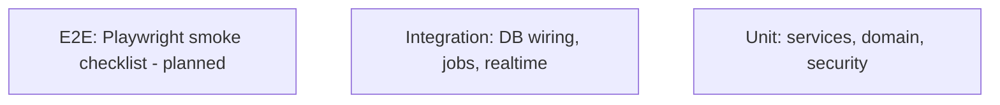

# Testing — Book-Tale: Test Strategy

| Field | Value |
| --- | --- |
| Version | v0.1 |
| Last Updated | 2026-08-06 |
| Owner | QA Engineer |
| Status | In Review |

---

## 1. Test Pyramid

## 2. Strategy

| Layer | Tool | Scope |
| --- | --- | --- |
| Unit | pytest | Services, domain, security rules |
| Integration | pytest + real SQLite/PG | Storage adapter ↔ DB, RQ jobs, audit repo |
| Concurrency | pytest threads | 20-thread racing issue/reserve |
| Security | pytest (tests/security/) | 90 tests: CSRF, rate limit, escalation, uploads, XSS, secrets |
| E2E | Playwright (planned) | Smoke checklist automation |

Current suite composition (verified):

| File | Tests | Covers |
| --- | --- | --- |
| tests/security/test_web_security.py | 90 | web security breadth |
| tests/test_auth_tokens.py | 10 | token lifecycle |
| tests/test_jobs.py | 16 | RQ jobs + fallback |
| tests/test_db_wiring.py | 18 | storage adapter |
| tests/test_library.py | 53 | catalog/transactions/recommender |
| tests/test_db_layer.py | 14 | concurrency/atomicity |
| tests/test_reading_progress.py | 2 | totals |

Total: **202 passing**, 2 skipped (Redis-dependent).

## 3. Critical Test Cases

| ID | Feature | Case | Expected |
| --- | --- | --- | --- |
| TC-001 | Lending | 20 threads race for last copy | 1 loan, 0 oversell |
| TC-002 | Auth | Privilege escalation attempt | Rejected (role whitelist) |
| TC-003 | CSRF | State change without token | Rejected |
| TC-004 | Rate limit | Login flood | Budget enforced, `deduct_when` on failures |
| TC-005 | Upload | HTML renamed to .png | Rejected (magic bytes) |
| TC-006 | Audit | Settings change | Append-only row with old→new, IP |
| TC-007 | Tokens | Reset token expiry | Rejected after 15m; single-use |
| TC-008 | Ready | `/readyz` DB down | 503 generic (no detail leak) |
| TC-009 | Jobs | Redis down | Bounded pool fallback |
| TC-010 | OpenAPI | Spec endpoint | Valid 3.1 spec |

## 4. Test Data Strategy

- Seed catalog (11,127 books) + demo users from seed scripts.
- Isolated test DB per run; no production data.

## 5. CI Gates

- `pytest tests/` green.
- Coverage gate: `--cov=db --cov-fail-under=85`.
- Ruff lint.
- Security scans (CI workflow).

## 6. Related Documents

| Document | Relationship |
| --- | --- |
| [Rules.md](../project/Rules.md) | Coverage requirements |
| [PRD.md](../product/PRD.md) | Release criteria |
| [TechSpec.md](TechSpec.md) | Components |
| [AppFlow.md](../design/AppFlow.md) | Flow tests |
| [Schema.md](Schema.md) | Data tests |
| [API.md](API.md) | Contract tests |
| [Design.md](../design/Design.md) | A11y tests |
| [ImplementationPlan.md](../project/ImplementationPlan.md) | Test tasks |
| [Tracker.md](../project/Tracker.md) | Status |
| [SecurityAndCompliance.md](SecurityAndCompliance.md) | Security suite |
| [Deployment.md](Deployment.md) | Test env |
| [Glossary.md](../reference/Glossary.md) | Vocabulary |
| [RiskRegister.md](../project/RiskRegister.md) | Risks |
